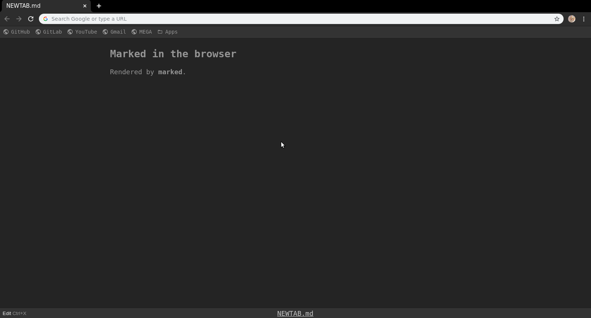

# NEWTAB.md

[](https://travis-ci.com/danilin-em/NEWTAB.md)
[](https://www.codacy.com/manual/danilin-em/NEWTAB.md?utm_source=github.com&amp;utm_medium=referral&amp;utm_content=danilin-em/NEWTAB.md&amp;utm_campaign=Badge_Grade)

Use New tab page, as Markdown notepad.



## Development

### Prepare

```sh

# 0. Clone repo
git clone git@github.com:danilin-em/NEWTAB.md.git

# 1. Go to folder
cd NEWTAB.md

# 2. Install requirements
npm install

```

#### Way 1: Dev Server (Without instalation)

```sh

# Start Dev Server
npm run dev

```

See on: [http://localhost:3000/](http://localhost:3000/)

> Note: *Bookmarks bar* shows **example data**

#### Way 2: Load Extension

```sh

# Watch & Build changes
npm run watch

```

1. Go to `chrome://extensions`
2. Enable `Developer mode`
3. Use `Load Unpacked Extension` select the `dist/` in repository
